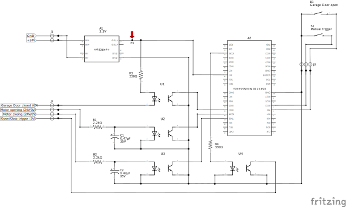

# HÖRMANN Promatic 3 ESPHome Bridge

This project is made to integrate the Hörmann Promatic 3 garage door drive unit into Home Assistant using ESPHome. This approach is more sophisticated compared to other solutions like using an Shelly or similar devices, but comes with some extra functionality:

- ✅ Detects `opening` and `closing` (motor running) as well as `open`/`close` (end position)
- ✅ Does support partially opened states, like `10%` for air ventilation (with auto-stop)
- ✅ can be linked with a Beacon device for zero-touch offline opening
- ✅ comes with a script blueprint to overcome the one-touch control and gain more specific control
- ✅ highly customizable
- ⚠️ requires PCB assembly and soldering
- ⚠️ requires ESPHome to flash the ESP firmware

> [!CAUTION]  
> Read the [official Manual](TR10A147_E_ProMatic_3_DE.pdf) for safety instruction. Never work on 230V when your're not an expert. Unplug the device before start working for your own safety and to prevent damages while assembling.

| Qty. | Ref.  | Part | Notes |
| :--: | :---: | :--- | :---- |
| 1    | A1    | **MP1584** 3,3V buck regulator | provides 3,3V stabilized; Input: 4,5–28 V |
| 1    | A2    | **ESP8266** D1 Mini or **ESP32** mini | use ESP32 version for BLE Support |
| 4    | U1-U4 | **PC819** optocoupler | for 24V/3,3V separation |
| 2    | R1-R2 | **2,2kΩ ½W** resistor | series resistor optocoupler LED at 24V |
| 2    | R3-R4 | **330Ω ¼W** resistor | series resistor optocoupler LED at 3,3V |
| 2    | C1-C2 | **0,47μF 35V** capacitor | catch voltage peaks from the driving motor |
| 1    | B1    | **reed switch** | to retrieve the "open" position |
| 1    | S1    | **momentary switch** | optional; for manual open/close/stop trigger |
| 1    | J1    | 2 leg **screw terminal** |  |
| 1    | J2    | 4 leg **screw terminal** |  |
| 1    | J3    | 3 leg **screw terminal** |  |

 A housing is also recommended since the PCB does not fit in the Promatic 3 housing. As reference: I'm using these [project boxes](https://www.amazon.de/dp/B0BWLW941S)

## Option 1: ESP8266 D1 mini

For basic functionalities the ESP8266 is totally suitable

### Circuit Diagram

### PCB-Design

If you like to order the PCB shown above, feel free to use the already exported production files. Or implement changes using **[fritzing](https://fritzing.org/download)** (check the [ESP8266 Pinout Reference](https://randomnerdtutorials.com/esp8266-pinout-reference-gpios/#wemos-d1-mini-pinout)!):
- **PCB-Design**: [ESP8266_extended-gerber.zip](ESP8266_extended-gerber.zip) (76 x 55,7mm)
- **Project File**: [ESP8266.fzz](ESP8266.fzz)

### Results (grid PCB)

I did my prototype on a grip PCB which also works great.  
Grid PCB: 70 x 50 mm / 24 x 18 holes / resistors vertical to save space

## Option 2: ESP32 D1 mini

For extended functionalities the ESP32 is the better option

> [!WARNING]
> While flashing the ESP32 D1 Mini I had some trouble. Please read the information below in the [ESPHome Firmware](#esphome-firmware)-Section.

### Circuit Diagram

### PCB-Design

If you like to order the PCB shown above, feel free to use the already exported production files. Or implement changes using **[fritzing](https://fritzing.org/download)** (check the [ESP32-mini Pinout Reference](https://www.espboards.dev/esp32/d1-mini32/)!):
- **PCB-Design**: [ESP32-mini_extended-gerber.zip](ESP32-mini_extended-gerber.zip) (78,7 x 54,6mm)
- **Project File**: [ESP32-mini.fzz](ESP32-mini.fzz)

### Results (Prototype)

I ordered a PCB and tried to do the soldering. Unfortunately there were some issues, that are resolved now in the ESP8266 and ESP32 PCB files (see commit 4a13bd1397be6c67168064e2b9723a02679394e2 for details)

## Connection

> [!WARNING]  
> Unplug the Hörmann drive unit before start working for your own safety and to prevent damages while assembling.

| this PCB | Promatic 3 / Auxiliary | Function | Notes |
| :------: | :--------------------- | :------- | :---- |
| J1.1 | Terminal: 20 | **GND**  | see manual page 25, image 11 |
| J1.2 | Terminal: 5 | **24V**  | see manual page 25, image 11 |
| J2.1 | Terminal: 0V | **closed** state | see manual page 27, image 17 + 20.1 * |
| J2.2 | black motor wire | motor **opening** | pulled to GND when motor is running |
| J2.3 | red motor wire | motor **closing** | pulled to GND when motor is running |
| J2.4 | Terminal: 21 | **open/close/stop** trigger | see manual page 25, image 11 |
| J3.1 | _Auxiliary_: reed switch   _Auxiliary_: momentary switch | common **GND** | may have two wires |
| J3.2 | _Auxiliary_: momentary switch | **manual trigger** | optional; pulled to GND as a trigger |
| J3.3 | _Auxiliary_: reed switch | **open** state | pulled to GND when triggered |

To find the correct Terminal on this project's PCB please use the circuit diagrams and the official handbook as reference:
- [ESP8266_circuit-diagram.pdf](ESP8266_circuit-diagram.pdf)
- [ESP32-mini_circuit-diagram.pdf](ESP32-mini_circuit-diagram.pdf)
- [TR10A147_E_ProMatic_3_DE.pdf](TR10A147_E_ProMatic_3_DE.pdf) (or see pictures below)

| Image 11 | Image 17 * | Image 20.1 * |
| :------: | :--------: | :----------: |
|  |  |  |

\* As can be seen in Image 20.1, the **DIP switch B** must be turned **ON**. This is required, so that the Terminal 0V (Image 17) gets activated when the Promatic 3 detects the garage door as closed. This will then subsequential set the garage door state in the ESP and Home Assistant to `closed`.

Once everything is connected, do a short test, put the project box on top of the drive unit and close the cover:

<table>
  <tr>
    <td rowspan="2" width=50%>Connection: 
      </td>
    <td>Box placement: 
       
      </td>
  </tr>
  <tr>
    <td>Open sensor (reed contact J3.1+J3.3): 
      </td>
  </tr>
</table>

## ESPHome Firmware

> [!WARNING]  
> While flashing the ESP32 D1 Mini I had some trouble. If you experience the same, here is what I did to overcome the issues:
> 1. The ESP32 D1 mini does not have a BOOT button. To put the device in FLASH-Mode, **`GPIO0` must be connected to `GND`** (see [Pinout Reference](https://www.espboards.dev/esp32/d1-mini32/)).
> 2. The [ESPHome Web Installer](https://web.esphome.io/) wasn't connecting to my device, but **the [Tasmota Web Installer](https://tasmota.github.io/install/) worked _sometimes_.**
> 3. To ensure proper connection I installed [ESPHome on the local PC](https://esphome.io/guides/installing_esphome/). From there I was able to **[compile and flash](https://esphome.io/guides/getting_started_command_line/#first-uploading) from the shell** (it's easy, don't be scared).  
>    - Command: `esphome run garage.yaml` _(you may adapt the yaml-name)_
> 4. When something seems to be corrupt an `erase-flash`-command from the [Espressif ESPTool](https://docs.espressif.com/projects/esptool/en/latest/esp32/) may help performing a **factory reset, if required** (see also [this Tutorial](https://randomnerdtutorials.com/esp32-erase-flash-memory/)).

### ESP8266 D1 mini
- Firmware Template: [ESP8266.yaml](ESP8266.yaml)

This file contains the basic configuration. You may change the values in the first 17 lines according to your favor. Changes beyond line 17 can break the functionality. If you want to add additional functionalities, feel free to add your yaml-code at the end.

### ESP32 D1 mini
- Firmware Template: [ESP32.yaml](ESP32.yaml)

This file is basically a copy of the ESP8266 and is working the same way. 

// FIXME: additional features and configuration

## Home Assistant Script + Automation

