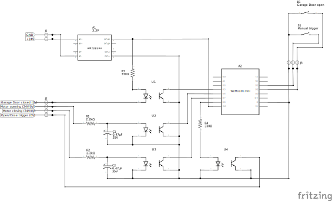

# HÖRMANN Promatic 3 ESPHome Bridge

This project is made to integrate the Hörmann Promatic 3 garage door drive unit into Home Assistant using ESPHome. This approach is more sophisticated compared to other solutions like using an Shelly or similar devices, but comes with some extra functionality:

- ✅ Detects `opening` and `closing` (motor running) as well as `open`/`close` (end position)
- ✅ Does support partially opened states, like `10%` for air ventilation (with auto-stop)
- ✅ can be linked with a Beacon device for zero-touch offline opening
- ✅ is detecting wrong directions and switching the direction if required to gain more specific control, beside the one-touch control
- ✅ highly customizable
- ⚠️ requires PCB assembly and soldering
- ⚠️ requires ESPHome to flash the ESP firmware

> [!CAUTION]  
> Read the [official Manual](TR10A147_E_ProMatic_3_DE.pdf) for safety instruction. Never work on 230V when your're not an expert. Unplug the device before start working for your own safety and to prevent damages while assembling.

| Qty. | Ref.  | Part | Notes |
| :--: | :---: | :--- | :---- |
| 1    | A1    | **MP1584** 3,3V buck regulator | provides 3,3V stabilized; Input: 4,5–28 V |
| 1    | A2    | **ESP8266** D1 Mini or **ESP32** C3 Mini | use ESP32 version for BLE Support |
| 4    | U1-U4 | **PC819** optocoupler | for 24V/3,3V separation |
| 2    | R1-R2 | **2,2kΩ ½W** resistor | series resistor optocoupler LED at 24V |
| 2    | R3-R4 | **330Ω ¼W** resistor | series resistor optocoupler LED at 3,3V |
| 2    | C1-C2 | **0,47μF 35V** capacitor | catch voltage peaks from the driving motor |
| 1    | B1    | **reed switch** | to retrieve the "open" position |
| 1    | S1    | **momentary switch** | optional; for manual open/close/stop trigger |
| 1    | J1    | 2 leg **screw terminal** |  |
| 1    | J2    | 4 leg **screw terminal** |  |
| 1    | J3    | 3 leg **screw terminal** |  |

 A housing is also recommended since the PCB does not fit in the Promatic 3 housing. As reference: I'm using these [project boxes](https://www.amazon.de/dp/B0BWLW941S).

## Option 1: ESP8266 D1 mini

For basic functionalities the ESP8266 is totally suitable

### Circuit Diagram

### PCB-Design

If you like to order the PCB shown above, feel free to use the already exported production files. Or implement changes using **[fritzing](https://fritzing.org/download)** (check the [ESP8266 Pinout Reference](https://randomnerdtutorials.com/esp8266-pinout-reference-gpios/#wemos-d1-mini-pinout)!):
- **PCB-Design**: [ESP8266_extended-gerber.zip](ESP8266_extended-gerber.zip) (76 x 55,7mm)
- **Project File**: [ESP8266.fzz](ESP8266.fzz)

### Results (grid PCB)

I did my prototype on a grip PCB which also works great.  
Grid PCB: 70 x 50 mm / 24 x 18 holes / resistors vertical to save space

## Option 2: ESP32 C3 mini

For extended functionalities the ESP32 is the better option

### Circuit Diagram

### PCB-Design

If you like to order the PCB shown above, feel free to use the already exported production files. Or implement changes using **[fritzing](https://fritzing.org/download)** (check the [LOLIN ESP32 C3 Mini Pinout Reference](https://www.espboards.dev/esp32/lolin-c3-mini/)!):
- **PCB-Design**: [ESP32-C3-mini_extended-gerber.zip](ESP32-C3-mini_extended-gerber.zip) (78,7 x 54,6mm)
- **Project File**: [ESP32-C3-mini.fzz](ESP32-C3-mini.fzz)

> I tested the ESP32 D1 Mini first, but it was causing a lot of trouble. Therefore, it is now **marked as legacy**. If you still want to use it take, look into the [legacy-folder](legacy/).

### Results (Prototype)

> For the ESP32-D1 mini ([legacy](legacy/)) I ordered a PCB and tried to do the soldering. Unfortunately there were some issues, that are resolved now in all PCB files (see commit [4a13bd1](../../commit/4a13bd1397be6c67168064e2b9723a02679394e2) and [b1b8725](../../commit/b1b872543b13843ac204b23dd64338c8f80fe5ec) for details)

## Connection

> [!WARNING]  
> Unplug the Hörmann drive unit before start working for your own safety and to prevent damages while assembling.

| this PCB | Promatic 3 / Auxiliary | Function | Notes |
| :------: | :--------------------- | :------- | :---- |
| J1.1 | Terminal: 20 | **GND**  | see manual page 25, image 11 |
| J1.2 | Terminal: 5 | **24V**  | see manual page 25, image 11 |
| J2.1 | Terminal: 0V | **closed** state | see manual page 27, image 17 + 20.1 * |
| J2.2 | black motor wire | motor **opening** | pulled to GND when motor is running |
| J2.3 | red motor wire | motor **closing** | pulled to GND when motor is running |
| J2.4 | Terminal: 21 | **open/close/stop** trigger | see manual page 25, image 11 |
| J3.1 | _Auxiliary_: reed switch   _Auxiliary_: momentary switch | common **GND** | may have two wires |
| J3.2 | _Auxiliary_: momentary switch | **manual trigger** | optional; pulled to GND as a trigger |
| J3.3 | _Auxiliary_: reed switch | **open** state | pulled to GND when triggered |

To find the correct Terminal on this project's PCB please use the circuit diagrams and the official handbook as reference:
- [ESP8266_circuit-diagram.pdf](ESP8266_circuit-diagram.pdf)
- [ESP32-C3-mini_circuit-diagram.pdf](ESP32-C3-mini_circuit-diagram.pdf)
- [TR10A147_E_ProMatic_3_DE.pdf](TR10A147_E_ProMatic_3_DE.pdf) (or see pictures below)

| Image 11 | Image 17 * | Image 20.1 * |
| :------: | :--------: | :----------: |
|  |  |  |

\* As can be seen in Image 20.1, the **DIP switch B** must be turned **ON**. This is required, so that the Terminal 0V (Image 17) gets activated when the Promatic 3 detects the garage door as closed. This will then subsequential set the garage door state in the ESP and Home Assistant to `closed`.

Once everything is connected, do a short test, put the project box on top of the drive unit and close the cover:

<table>
  <tr>
    <td rowspan="2" width=50%>Connection: 
      </td>
    <td>Box placement: 
       
      </td>
  </tr>
  <tr>
    <td>Open sensor (reed contact J3.1+J3.3): 
      </td>
  </tr>
</table>

## ESPHome Firmware

### ESP8266 D1 mini
> **Firmware Template: [ESP8266.yaml](ESP8266.yaml)**

This file contains the basic configuration. You may change the values in the first 17 lines according to your favor. Changes beyond line 17 can break the functionality. If you want to add additional functionalities, feel free to add your yaml-code at the end. The default code exposes the following entities to Home Assistant:
- **Cover-Entity**
  - with percentage % control (`device_class: garage`)
- **Binary Sensors**
  - From every GPIO; deactivated by default (open, closed, opening, closing, external button press, manual trigger)
- **Diagnostics** (Connection Status, WiFi Signal)

### ESP32 C3 mini
> **Firmware Template: [ESP32-C3-mini.yaml](ESP32-C3-mini.yaml)**

> [!NOTE]
> The board I used is the [LOLIN ESP32 C3 Mini](https://www.espboards.dev/esp32/lolin-c3-mini/) which has a RGB onboard LED. These RGB-LEDs are not supported by the [ESPHome Status-LED](https://esphome.io/components/light/status_led/). So I wrote a quick package, utilizing the onboard RGB LED to display the status of the board. Details can be found in my [ESPHome RGB Status LED Package](https://github.com/Flo-R1der/ESPHome_RGB-Status-LED_Package).

This file is basically a copy of the ESP8266 and is working the same way. Also the entities mentioned above are similar. However, the ESP32 has some considerable extras defined:
- **Bluetooth Beacon**
  - can be used to identify the vehicle or occupancy of the garage.
  - To discover bluetooth beacons, you might use the [discovery code](ESP32-C3-mini_beacon-discovery.yaml) first.
- **Bluetooth Proxy**
  - To proxy bluetooth signals (button press, BLE-sensors, etc.) to your Home Assistant instance.

> I tested the ESP32 D1 Mini first, but it was causing a lot of trouble. Therefore, it is now **marked as legacy**. If you still want to use it take, look into the [legacy-folder](legacy/).

 

---

## Home Assistant Automation

> [!NOTE]  
> This repository aims to provide the ESP device and its directly related elements (circuit diagram, PCB, ESPHome-yaml, ...). Therefore, this section here is only for information, but without further support.

**Prerequisite**:   
Make sure, the **Background Location** is enabled on your phone and [set up correct](images\background-location.jpg).

 

Here are the two automation I'm using in combination with the ESP8266 and ESP32:
- **Trigger** is always the distance to the Garage/Home-Zone from the [**Proximity Sensors**](https://www.home-assistant.io/integrations/proximity/):
   - below: 20 = ARRIVING | above: 100 = LEAVING
- **Condition** is important to filter, weather you are in your car and not, using taxi/bus/bicycle/feet:
   - _Variant 1_: Enable the [**Android Auto Sensor**](https://companion.home-assistant.io/docs/core/sensors/#android-auto) and check if connected or not.
   - _Variant 2_: Utilize the [**Bluetooth Sensors**](https://companion.home-assistant.io/docs/core/sensors/#bluetooth-sensors) to look for a specific connected Bluetooth Device.
   - _BLE Option_: With the [ESP32 **Bluetooth Low Energy Tracker**](https://esphome.io/components/esp32_ble_tracker/) you can detect, if the garage is already occupied.
- **Action** simply open or closes the garage:
   - if ARRIVING and garage closed: `cover.open_cover`
   - if LEAVING and garage opened: `cover.close_cover`

Here's the YAML-Code for my two examples:
- [Automation 1](automation_1.yaml): using Condition _Variant 1_
- [Automation 2](automation_2.yaml): using Condition _Variant 2_ and the _BLE Option_
